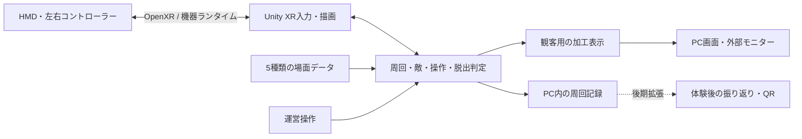

# 死に戻りVRデモ — システム構築・制作計画 v0.1

作成日：2026-09-16  
状態：実装前のレビュー案。環境の読み取り確認と設計まで実施。Unityプロジェクト・実行ファイルは未作成。  
対象：PC接続型HMD、Unity、主に企画者とCodexによる数週間の制作。

## 1. 今回つくる体験

**理解できない速度で死に戻り、同じ数秒を先回りして突破する、3分以内のVR密室体験。**

最初は死んだことさえ分からず、次の遭遇で前の暗転が死だったと気づく。死亡から再開までに説明画面や確認操作を入れない。体験者は世界が再び動いている最中に状況を理解する。

攻略の中心は、攻撃を見てから大きく姿勢を変える反射動作ではなく、記憶を使って先に手を動かすこと。短い身体動作で遮蔽・消灯・扉の妨害などの仕掛けを操作し、その先の時間へ到達する。最後は、自分の行動で突破できた達成感と、もう戻されない短い余韻を残す。

### 合意済みの方向

- 初回は死が曖昧、次の遭遇から死因を理解する構成。
- 死亡・場面転換の速さを重視。初回死亡や2回目死亡を強制すること自体は目的にしない。
- 姿勢変更に時間を掛けず、先回りした短い身体動作と仕掛けの操作を組み合わせる。
- 2m×2mでの体験、装着等を除いて3分以内を目標にする。
- 待機客には死に戻りの存在が分かってよい。具体的な死因や突破方法は守る。
- 約5種類の場面を体験者ごとに切り替える方法と、加工した観客映像を検討する。
- PC接続型HMDを使用し、主に企画者とCodexで数週間かけて制作する。

### この計画で提案すること（実装範囲の確認対象）

- 共通の小部屋と共通操作を使い、5つのシナリオデータを用意する。同じ人の周回中はシナリオを変えない。
- まず1場面で核心を検証し、2場面で観戦後の体験を検証し、最後に5場面へ拡張する。
- 最初はコントローラー操作。ハンドトラッキング・自由歩行・自由戦闘は初期範囲に含めない。
- UnityのWindowsアプリ1つで、HMD、観客表示、簡易運営操作、履歴保存を担当する。
- 外部サーバー、アカウント、複数HMD同期は初期デモには設けない。
- 本は消さず、世界の初期状態を繰り返す。身体の実際の位置・姿勢は巻き戻さない。

場面の物語、各場面の正解、時間切れの結末は未確定。以下の内容は実装可能な検証案であり、既に合意された設定とは区別する。

## 2. 確認できた環境と未確認事項

| 項目 | 現在の確認結果 | 次の対応 |
| --- | --- | --- |
| Unity Hub | 標準インストール先に存在 | 新規導入を前提にしない |
| Unity Editor | 6000.3.15f1の実行ファイルを確認 | このバージョンで新規プロジェクトを作る候補 |
| Windowsビルド環境 | windowsstandalonesupportを確認 | PCVR向けに使用する候補 |
| Android関連 | AndroidPlayer、ADB、NDK、OpenJDKの存在を確認 | 今回のPCVRでは必須にしない |
| この作業フォルダー | 既存のプロジェクトファイルなし | 既存作品の上書きは不要 |
| GPU・CPU・メモリ | システム情報の取得がアクセス拒否となり未確認 | PCVR性能の確約はしない。実機接続時に確認 |
| HMD | PC接続型という方針のみ確定 | 正確な機種、コントローラー、接続方式を確認 |
| ライセンス・パッケージ取得 | Editor起動・認証・依存解決は未実施 | プロジェクト作成段階で確認 |
| OpenXRランタイム | 種類・有効化状態は未確認 | HMDに対応したランタイムを選び、追跡と入力を検証 |

ファイルの存在確認は、正常な起動・ビルド・HMD動作の検証を意味しない。今回はアプリのインストールや機器設定の変更を行っていない。

## 3. システムの全体構成

### フロントエンド

UnityがHMD内の部屋、手、敵、空間音響、コントローラー振動、即時復帰演出を描画・再生する。別の観客カメラが、情報を制限した映像をPC画面へ表示する。

### バックエンドに相当する部分

初期版ではサーバーではなく、同じUnityアプリ内のC#ロジックが担当する。周回管理、敵の状態、操作の結果、時間制限、シナリオ選択、記録保存を一元管理する。外部通信や保存の終了を待たずに死に戻りを完了できる構成にする。

### 初期版の通信

| 経路 | 方法 | 備考 |
| --- | --- | --- |
| HMD・コントローラー ↔ PC | 機器に対応する接続とOpenXRランタイム | Quest系ならLink等を候補にする。OpenXR自体がUSBやWi-Fi映像転送を行うわけではない |
| Unity内の各機能 | C#のイベント・メソッド呼び出し | HTTPやWebSocketを挟まない |
| PC → 外部モニター | PCの画面出力 | 観客用の加工画面を表示。HMDの無加工ミラーを代用しない |
| Unity → 周回履歴 | ローカルJSONファイル | バッファに記録し、主に体験終了時に保存する |

PCに接続されたモニターを使う限り、映像配信用サーバーは不要。複数画面への出力はUnityのMulti-displayを候補にするが、XRと組み合わせたウィンドウ・ミラー出力の挙動は第1週にWindowsビルドで確認する。[Unity：Multi-display](https://docs.unity3d.com/6000.3/Documentation/Manual/MultiDisplay.html)

## 4. Unity基盤の選定案

| 項目 | 第一候補 | 採用理由・確認内容 |
| --- | --- | --- |
| Editor | インストール済みの6000.3.15f1 | 環境変更を減らす。問題が出れば更新の必要性を判断 |
| 描画 | URP | 小部屋・限られた照明で構成。描画負荷を予算内に収める |
| XR | XR Plug-in Management＋OpenXR Plugin | 機器の追跡・描画・入力基盤 |
| 操作 | XR Interaction Toolkit＋Input System | 掴む、押す、レバー操作、入力定義 |
| 入力機器 | 左右コントローラー | 初期検証では確実な入力と触覚フィードバックを優先 |
| HMDなしの確認 | XR Interaction Simulator | ロジックや操作の事前確認。実機評価の代替にはしない |
| 敵の行動 | 明示的な状態遷移と経路ポイント | 条件と結果を検証しやすく、同じ未来を再現できる |
| テスト | Unity Test Framework＋実機テスト | 状態復元・時間制限は自動、身体感覚は人が評価 |

Unity 6000.3の公式ページではOpenXR 1.16.1、XRI 3.3.2が当該Editor系列向けのリリース版として記載されている。これらを開始候補にし、Package Managerで解決・検証してからmanifestとlockファイルに固定する。最新のプレビュー版へ自動追従しない。[OpenXR](https://docs.unity3d.com/6000.3/Documentation/Manual/com.unity.xr.openxr.html)、[XRI](https://docs.unity3d.com/6000.3/Documentation/Manual/com.unity.xr.interaction.toolkit.html)

Simulatorはキーボード等からXR入力を模擬する公式サンプルを利用する。[Unity：XR Interaction Simulator](https://docs.unity3d.com/Packages/com.unity.xr.interaction.toolkit@3.3/manual/xr-interaction-simulator-overview.html)

Quest系と確定しても、初手でMeta SDKの全機能を追加する前提にはしない。対象機器で必要な機能を確認して追加する。接続は利用可能なら有線を最初の検証候補とし、無線は会場条件も含め別途検証する。

## 5. 最小デモの仕様

### 最初の1場面

小部屋、時計、短い指示カード、敵1体、遮蔽板のハンドル、出口操作を配置する。立ったまま手元の短い操作で最初の危険をやり過ごせるようにする。

**検証用の仮設定：敵の侵入操作により出口が一時解除される。攻撃を遮った後に出口を操作すると脱出できる。** 解除ランプと音で因果を示す。この設定の採用は計画確認時に決められる。

| 周回内の時刻例 | 世界で起きること | 体験者の選択 |
| --- | --- | --- |
| 0秒 | 同じ時計のチャイム。手元に短い指示 | 初回は読む。以後は先回りできる |
| 3秒 | 扉の鍵・足音 | 危険の方向を知る手がかり |
| 6秒 | 敵の最初の射撃 | 遮蔽が間に合っていれば生存。無防備なら即時復帰 |
| 射撃後 | 敵が確認・捜索へ。出口解除が見える | 次の短い操作を試す |
| その後 | 出口操作の機会、または再発見・攻撃 | 脱出、または再び戻る |

秒数は固定仕様ではない。初回の読解完了や視線追跡を死亡条件にしない。カードを読まない人も進行できる。遮蔽物に隠れた人を脚本上の都合だけで即死させない。

### セッション時間

最初のチャイムから数えて、通常進行では180秒以内に結末表示まで完了する。死亡や暗転の時間も含む。暫定で操作可能区間を最大172秒、結末を最大8秒とする。早期脱出ならその時点から結末に入る。

時間切れは自動成功にせず「脱出未達」の短い終わり方を用意する。全員成功を要件にする場合は、最終盤の明示的な補助を別途設計する。

装着、機器キャリブレーション、操作説明は開始前に行う。中断・追跡喪失時は安全上の停止を優先し、通常クリアや死亡として数えない。必要ならそのセッションを中止して再準備する。3分の運用枠を守るために危険な状態で続行しない。

## 6. 2m×2mの空間と身体の扱い

### 固定した操作範囲を使う

1 Unity unit＝1mで設計する。現実の安全な範囲と手の到達範囲を開始前に確認し、前方と左右の近距離に操作対象を配置する。距離・高さは身長や腕の長さに合わせて調整し、開始後は固定する。前方約0.35〜0.55mは試作の初期値候補に過ぎず、万人に届く寸法とは扱わない。

仮想の部屋は奥行きを持たせても、遠方へ歩くことをクリア条件にしない。出口は手元の操作で成立させ、その後の演出で脱出を表す。ダッシュ、飛び込み、倒れ込み、背後への踏み出しは要求しない。仮想の机や遮蔽物に体重を預ける操作も要求しない。

### ループ時に身体を移動させない

初期デモではXR Originを死亡ごとに回転・平行移動しない。現在のHMD・手の追跡を維持し、部屋の状態だけを初期値へ戻す。従って「時刻と物品は戻るが、自分の身体はそのまま」という表現になる。しゃがみ・手の位置が次周回に有利なら、その結果を認める。

XR Originは追跡座標を仮想空間へ変換する仕組みであり、現実の残り移動範囲を増やすものではない。[Unity：XR Origin](https://docs.unity3d.com/6000.3/Documentation/Manual/xr-origin.html)

空間回転による再配置は後期研究候補とする。物理位置の偏り、手の届き方、方向の学習、酔いを実測せず採用しない。境界表示を無効にせず、境界付近に攻略対象を置かない。2m×2mはプレイ範囲であり、待機列・モニター・運営者の配置は別に必要になる。[Meta：Health and safety guidelines](https://developers.meta.com/horizon/design/mr-health-safety-guideline/)

## 7. 死に戻りと状態管理

周回ごとにシーンを読み直さず、読み込み済みの部屋の状態を復元する。敵・物品・音・エフェクトを事前生成しておき、復帰にネットワークやディスク読み込みを必要としない。

### 状態を3層に分ける

| 層 | 内容 | 死に戻り時 |
| --- | --- | --- |
| セッション | シナリオID、開始時刻、総経過時間、周回数、行動履歴 | 保持 |
| 周回 | 敵、扉、照明、物品、周回時刻、解除状態、予約イベント | 初期値へ復元 |
| 身体・XR | HMDと手の現実の位置・姿勢 | 追跡を継続し、巻き戻さない |

### 復帰処理の順序

1. 致死判定を一度だけ受理し、死因と周回時刻を記録する。
2. 旧周回の敵行動・予約発砲・効果音・コルーチン等を停止する。周回IDを更新し、遅れて届く旧イベントを無効にする。
3. HMD両眼に短い暗転を表示する。姿勢追跡は継続する。
4. 選択・掴み状態を解除し、物品の位置、回転、速度、扉、照明、敵を復元する。手に持っていた物は元の場所に戻る。
5. 接触・入力状態を整える。前周回のボタンイベントを再送しない。次の新しい押下・把持を受け付け、入力解除待ちで体験全体を止めない。
6. 周回時計とチャイムを開始し、視界と操作を戻す。再開後に隠れた待ち時間を追加しない。

暗転開始〜視界復帰を暫定0.10〜0.25秒の比較対象とする。これは達成済み性能ではなく、快適さと速さを探る実験値。死亡からの合計時間、状態復元時間、再操作可能になる時刻も別々に記録する。

復帰時に接触している手と復元物品の衝突、持ったままのボタン入力、アニメーション途中、音の重複を重点確認する。描画だけ戻っても、古い攻撃が残る実装は不可。

## 8. 敵とインタラクション

敵の基本状態は「待機→侵入→認識・捜索→攻撃／妨害への反応」。経路は少数の固定ポイントから始める。必要性が出たらNavMeshを追加する。

| 入力条件 | 敵の反応 | 禁止する不整合 |
| --- | --- | --- |
| 射線が遮られる | 攻撃が遮られる、確認・捜索へ移る | 見えていないのに位置を常時把握する |
| 消灯される | 可視性が変わり、最後に見た位置を調べる | 消灯だけで全記憶が消える |
| 扉が妨害される | 侵入が遅れ、解除・突破動作を見せる | 何の反応もなくすり抜ける |
| 音を立てる | 音源へ注意を向ける | 操作結果と無関係にランダムで方向を変える |

物理照明の明るさだけから敵の視認判定を推測せず、ゲーム用の明暗状態を持ち、描画と一致させる。遮蔽はレイ等で確認する。初期版の身体判定はHMD位置と近似した上半身を用いるため、実際の全身追跡とは異なる。立ち位置・頭の傾きによる誤判定を実機で確認する。

同じ入力条件では同じ結果を目指す。初期版はランダム攻撃を使わず、物理シミュレーション全体の完全な再現性を保証する設計にはしない。重要なレバー、遮蔽、出口は明示した状態と閾値で判定する。

## 9. 5場面の増やし方

5種類の完全に別の大規模ステージではなく、共通ルームと差し替え部品、ScriptableObjectの設定を組み合わせる。セッション開始前に選択し、その人の周回中は固定する。既定は1→2→3→4→5の順で、運営側で指定可能にする。

以下は差分候補。いずれも「短い操作」「先回り」「出口へ進む機会」が必要で、別の場面で覚えた操作方法は使えるが、正解手順が全て同じにはならないようにする。

| ID | 仮テーマ | 学ぶ関係 | 制作上の扱い |
| --- | --- | --- | --- |
| S01 | 遮蔽 | 射線を先に遮ると先へ進める | 最初の検証対象 |
| S02 | 消灯 | 見られる前に照明を変えると敵の認識が変わる | 2種類目。S01の操作をそのまま真似ても成立しないか確認 |
| S03 | 扉の妨害 | 侵入を遅らせた時間に準備できる | S01・S02の部品を再利用 |
| S04 | 音の誘導 | 音源への注意が、操作の機会を生む | 敵の音反応を追加する候補 |
| S05 | 機会の見極め | 解除の合図に合わせ、既知の操作を組み合わせる | 単なる高難度版にせず同等の所要時間へ調整 |

S03〜S05の具体的なクリア条件は、S01・S02の評価後に確定する。順番を入れ替えるだけで情報漏れがなくなるとは扱わない。長く待って全種類を見た客でも驚けることを保証しない。

## 10. 観客表示と運営表示

観客表示はHMD映像を一律にぼかす方式ではなく、別の視点・別の表示対象を使う。死に戻りの存在、テンポ、体験者の上達は見せてよい。正確な死因・操作対象・解除条件は制限する。

| 表示 | 見せるもの | 隠すもの |
| --- | --- | --- |
| HMD | 本来の世界と操作対象 | 周回数などゲーム外の説明UI |
| 観客 | 簡易アバター、部屋の雰囲気、反復、結果 | 操作ラベル、正確な敵の位置・射線、解錠表示 |
| 運営 | シナリオ、経過時間、入力状態、中断・開始 | 観客画面へ混入させない |

観客用は専用レイヤーとCulling Maskを使用し、攻略に関わる物体を非表示または別表現にする。表示物だけでなく、その影・反射・音からの漏れも確認する。ぼかしや輪郭表示は補助とし、読める文字や正確な手順を映してから隠す方式に依存しない。

同じ物体で描画用の影だけ残ってしまう場合は、観客用の簡略モデルと照明に置き換える。最初は簡単な俯瞰表示から作り、必要な情報が伝わるかを先に試す。

外部モニターが1台なら加工画面を優先し、運営UIは準備時のみ表示する。2台以上ある場合に観客・運営を分離する。自動起動するランタイムのミラー画面やEditorのGameビューが観客側へ出ないことを確認する。

HMD音声は体験者向けにする。最小版では観客用の音を出さず、音響の別系統化は後期候補。観客映像はまず720p・30fps相当を調整開始点とし、HMDの負荷が増えるなら解像度・描画頻度・影から減らす。これらは暫定値であり測定結果ではない。

## 11. モジュールと制作物

| モジュール案 | 責務 |
| --- | --- |
| SessionController | セッション開始・終了、180秒上限、成功・中止・時間切れ |
| LoopController | 致死イベント、即時復帰の処理、周回ID |
| ScenarioDefinition / ScenarioDirector | 場面設定、イベント時刻、条件分岐、選択順 |
| RoomStateRegistry | 復元対象と初期値を登録し、復元漏れを防ぐ |
| EnemyController / Perception | 敵の状態、視認、射線、音、妨害への反応 |
| InteractionAdapters | XR入力を押す・引く・掴む等のゲーム操作へ変換 |
| OutcomeResolver | 脱出と致死の競合を一度だけ確定する |
| SpectatorPresenter | 公開情報だけを使った観客表示 |
| OperatorPanel | 開始、終了、場面選択、確認用情報 |
| SessionRecorder | セッションID、場面・設定版、操作・死亡・脱出時刻の保存 |

シーンは起動・準備用と共通ルームを基本にし、周回で再ロードしない。スクリプト、Prefab、設定データ、仮素材、テストを分けて管理する。最初から汎用ゲーム基盤を大きく作るのではなく、1場面に必要な責務から実装する。

制作後の納品対象はUnityプロジェクト、Windows実行版、起動・HMD接続手順、運営手順、既知の制限、テスト記録。編集作業・一時ビルドはwork配下、利用者が開く計画書と納品物はoutputs配下に置く。

## 12. 体験後の記録と通信の拡張

最小版では、ランダムなセッションID、シナリオID、周回ごとの操作・結果だけをPC内に保存する。個人情報、マイク録音、HMDカメラの映像保存は不要。手の連続軌跡を記録する場合も、検証に必要な場合に限定する。

QR配布は次の順で検討する。

1. 共通の攻略・解説ページへのQR：静的ページで足り、バックエンド不要。URL確定と公開は後工程。
2. 個人別の周回記録：終了時だけ小さなJSONをHTTPS送信し、閲覧用IDを返す。小規模APIと保存先を追加する。スマートフォンから到達可能なURLを使い、PC内のlocalhostをQRにしない。
3. タブレット運営・遠隔観戦：必要な場合だけローカルWebSocket等を追加。映像転送はイベント通知と別の仕組みとして見積もる。

通信を追加する場合はsessionId、loopId、sequence、eventType、時刻、設定版を持たせる。再接続時は現在状態を取り直し、旧周回の入力・イベントを適用しない。外部送信の失敗で本編を止めず、ローカル記録を残す。観客端末には伏せるべき攻略データ自体を送らない。

## 13. 制作工程と分担

目安は3〜4週間。機材が使え、Unityが起動でき、企画者が定期的に実機評価できる前提の暫定計画。作業時間・既存素材・機材接続の状況によって変動し、納期保証ではない。

| 工程 | 目安 | つくるもの | 次へ進む条件 |
| --- | --- | --- | --- |
| P0：計画確認 | 現在 | 本計画、初期仕様、評価項目 | 最小デモ範囲・機材条件を確認 |
| P1：基盤と1場面 | 第1週 | XR接続、短い操作、敵、即時復帰、脱出、Simulator | 実機で反復と一手の効果が確認できる |
| P2：2場面と観客表示 | 第2週 | S02、加工表示、運営操作、記録、3分制限 | 観戦しても自分の場面で発見が残る |
| P3：5場面へ拡張 | 第3週 | S03〜S05、音・光の調整、難度調整 | 全場面のクリア経路が成立し、復元漏れがない |
| P4：展示向け仕上げ | 第4週／調整枠 | 連続運用、性能調整、手順書、QR導線 | 連続セッションと終了・再準備が安定 |

3週間が上限なら、独自モデル・高度な映像加工・個人別Web記録を後回しにする。5場面が間に合わない場合は勝手に完成扱いにせず、2場面の品質を優先するか、期間を延ばすかを実測後に相談する。

Codexは設計、コード、シーン構築の自動化、設定データ、テスト、ビルド手順、修正を担当する。企画者はHMD装着での体感評価、周囲の空間確認、初心者による試遊の手配、演出・難度の判断を担当する。こちらから人間の視覚・身体感覚を検証したとは扱えない。

## 14. 検証と受け入れ基準

### 自動・開発環境で確認する項目

- 同じ周回で致死イベントが重なっても復帰は1回だけ。
- 旧周回の発砲・タイマー・音が新周回へ漏れない。
- 物品、照明、敵、扉、速度、選択状態が100回の強制ループ後も初期値に戻る。
- シナリオIDはセッション中固定。次の体験者では正しい順に切り替わる。
- 総経過時間が死亡でリセットされず、通常セッションが180秒以内に終了する。
- 脱出と死亡が近接しても結末は一度だけ。判定時刻と同時刻の優先規則を固定する。
- 各場面に少なくとも1つの成功経路があり、無操作時の失敗と分岐条件を再現できる。
- PCVRの実行版で観客画面へ無加工ミラーが混入しない。

### HMDで確認する項目

- 実際に届く距離で、事前に知っていれば一手を実行できる。
- 暗転の速さが不具合に見えず、同じチャイムで反復が伝わる。
- 復帰直後に入力でき、掴み解除・物品復元で手が引かれたように見えない。
- 小さな頭の動き、しゃがみ維持、左右の手、姿勢の違いで不公平な判定にならない。
- 境界越え、急な後退、実体のない机への寄り掛かりを誘発する配置になっていない。
- 初心者が操作説明と世界の情報を区別できる。

### 性能

HMDの選択リフレッシュレートに合わせてフレーム予算を決める。90Hzなら約11.1ms、72Hzなら約13.9msが1フレームの目安。平均FPSだけでなく、周回復元時の突出、CPU/GPU時間、ランタイムの取りこぼしも記録する。実機の表示モードは未確認で、90Hz動作を保証するものではない。[Meta：Performance analysis](https://developers.meta.com/horizon/documentation/unity/unity-perf/)

VR本体だけの場合と観客描画を追加した場合を比較し、復帰処理のGCや同期保存を避ける。性能が不足した場合、まず観客描画の負荷と照明・影・エフェクトを減らす。Metaの公式最適化資料も参照する。[Meta：Quest and PCVR best practices](https://developers.meta.com/horizon/documentation/unity/unity-best-practices-intro/)

### 体験評価

初期評価は少人数の形成的テストとし、統計的な結論や万人への保証には使わない。「何が起きたと思ったか」「次に何をしようとしたか」「自分の行動で変わったと感じたか」を体験後に聞く。途中に説明を挟んで核となる速さを壊さない。

未観戦で始める人と、加工映像で別の場面を見てから始める人を比較する。最初に有効な操作を行うまでの周回数、突破時間、驚き、達成感を記録する。観客にも映像から何が分かったかを聞き、隠しすぎと漏らしすぎを調整する。

展示候補版では全5場面を含む10セッション以上の連続運用を暫定確認項目にする。これは最低限の試行であり、長時間運用の保証ではない。

## 15. 主要なリスクと判断方法

| リスク | 先に確かめること | 対応 |
| --- | --- | --- |
| 速すぎて何も学べない | 正解を知った人でも操作が間に合うか | 最初の予備時間を調整し、死亡から復帰までの速さは保つ |
| 反復が不具合に見える | 同じ音・物品・敵の出来事を認識できるか | 再現の目印を増やす。最初から死亡説明UIは出さない |
| 2m範囲からずれる | 実際の手の到達と身体移動 | 近距離操作へ寄せ、空間回転でごまかさない |
| 観戦で手順が分かる | 何の情報から攻略を推測できたか | 場面差と観客表示の両方を修正 |
| 5場面の作り込みが重い | 2場面時点の実工数 | 共通部品を再利用し、追加範囲と日程を見直す |
| HMD接続や性能が不安定 | 実機起動・入力・描画負荷 | 最初の週に接続検証し、無線や高負荷演出を後から評価 |
| 死亡後に古い処理が残る | 連続復帰・同時イベント | 周回ID、停止処理、復元対象登録で防ぐ |

## 16. 次の実装範囲と残る確認事項

最初の制作単位は「PCVRの1部屋、敵1体、先回りする短い操作1種類、即時復帰、1つの脱出経路、180秒上限、HMDなしの確認手段」。最初の試作素材は簡単な形状と仮音とし、速さと操作が成立してから外観を作り込む。

機材確認はHMDの正確な機種、接続方式、左右コントローラー、使用PCのGPU、観客用モニター台数。運用確認は2m×2mが活動範囲か展示全体か、締切日と実機評価に使える頻度。

本計画に対して「PC接続・コントローラー・1場面から開始し、2場面で観戦を検証して5場面へ」という実装範囲を確認した後、Unityプロジェクト作成へ進む。これは最初の依頼にある「計画書作成後、お互いの同意後に制作」という進め方に沿う。
